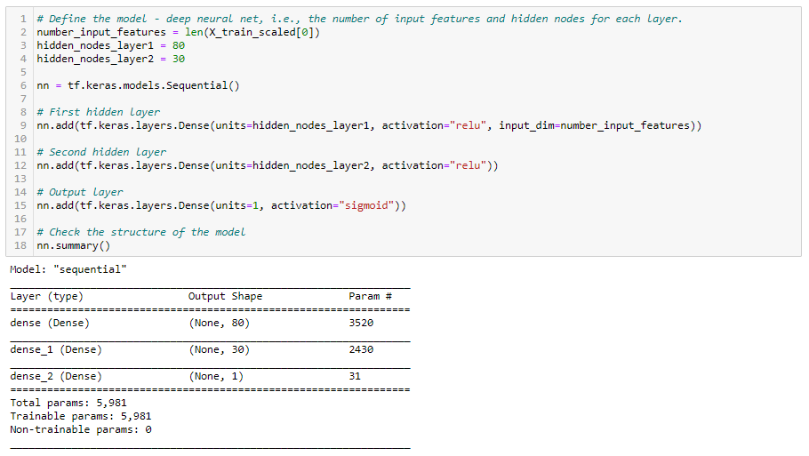
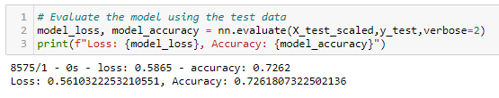

# Neural Network Charity Analysis Using TensorFlow in Python

## Overview

### Purpose
The purpose of this analysis was to create a binary classifier that is capable of predicting whether applicants will be successful if funded by Alphabet Soup, a non-profit philanthropic foundation.

## Results

### Data Preprocessing

- The variable that is considered the target for this model is the IS_SUCCESSFUL variable which shows whether or not an applicant organization was successful or not. This is our target variable, or dependent variable, because we want to gain a deeper understanding of what makes an applicant organization successful.
- The variables that are considered to be the features for the model are the APPLICATION_TYPE, AFFILIATION, CLASSIFICATION, USE_CASE, ORGANIZATION, STATUS, INCOME_AMT, SPECIAL_CONSIDERATIONS, and ASK_AMT. These are our independent variables that act as inputs in helping make the prediction.
- There are two variables that are neither a target nor feature and were removed from the dataset - EIN and NAME. These variables were removed because they would not be helpful in making predictions as there can be no reasonable conclusions drawn from an ID number or simply the name of the organization itself.

### Compiling, Training, and Evaluating the Model

- For the first run of the model, I chose two hidden layers with the first hidden layer having 80 nodes and the second layer having 30 nodes. Both hidden layers had a ReLu activation function and the output layer had a sigmoid activation function. I chose two hidden layers because I did not want to overfit the model and I chose 110 total nodes because the general rule of thumb for a simple model is to use 2-3 times as many nodes as there are inputs. After encoding the string datatypes into numbers which could be passed into the neural network, there were 44 inputs and 110 nodes fits nicely between 2-3 times the 44 inputs. I chose the ReLu activation function for the hidden layers because it identifies nonlinear characteristics from the input values. I chose the sigmoid activation function for the output layer as the sigmoid function is ideal for binary classification since its values are normalized to a probablility between 0 and 1.

- After the first run of the model, I achieved a predictive accuracy of 73%, which is lower than the target predictive accuarcy of 75%.

- I made three attempts to increase the model performance:

#### Attempt 1

In my first attempt, I noticed that the ASK_AMT variable had a lot of unique values so I attempted to bucket the data by creating categorical values and reassigning the data points to new corresponding values. As seen in the screenshot, there were many different values ranging from 5000 to over 8 billion. Based on the median of 5000, I created five buckets which I felt distributed the values as best as possible.
